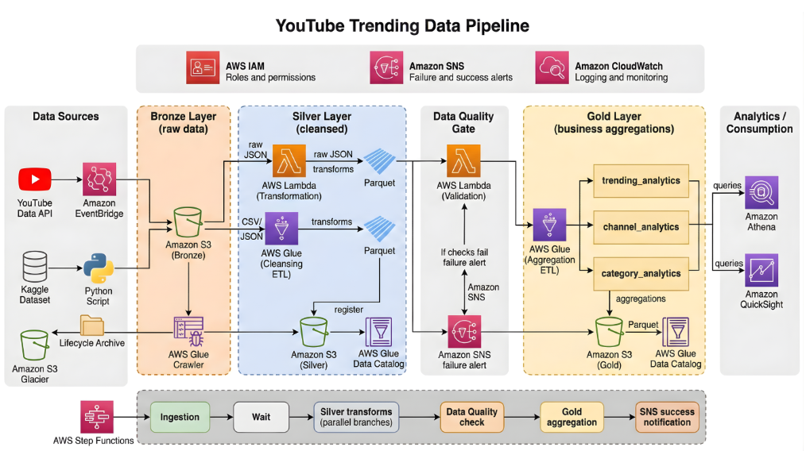

# YouTube Trending Data Pipeline

A cloud-native ETL pipeline that ingests YouTube trending video data across 10 regions, transforms it through a medallion architecture (Bronze > Silver > Gold), enforces data quality gates, and produces analytics-ready aggregations — all orchestrated by AWS Step Functions with infrastructure managed via Terraform.

This project is built upon the original work by [Darshil Parmar](https://github.com/darshilparmar/youtube-data-piepline-aws-s3-lambda-glue-athena-stepfunction/tree/main). Our enhancements include:
- **Terraform IaC** — full infrastructure as code replacing manual AWS CLI setup
- **CI/CD with GitHub Actions** — automated deploy on push
- **Bug fixes** — Lambda VPC networking, Glue Catalog partition persistence, JSON API data parsing, Step Functions invocation paths
- **Secrets Manager** — secure YouTube API key management



---

## Table of Contents

- [Overview](#overview)
- [Architecture](#architecture)
- [Tech Stack](#tech-stack)
- [Project Structure](#project-structure)
- [Data Flow](#data-flow)
- [Gold Layer Output Tables](#gold-layer-output-tables)
- [Prerequisites](#prerequisites)
- [Deployment with Terraform](#deployment-with-terraform)
- [CI/CD with GitHub Actions](#cicd-with-github-actions)
- [Running the Pipeline](#running-the-pipeline)
- [Monitoring and Alerting](#monitoring-and-alerting)
- [Security Notes](#security-notes)
- [Supported Regions](#supported-regions)
- [Data Sources](#data-sources)

---

## Overview

This pipeline automates the end-to-end process of collecting, cleaning, and analyzing YouTube trending video data. It uses the live YouTube Data API v3 to fetch trending videos and category mappings, then produces three sets of business analytics tables:

- **Trending Analytics** — daily trending metrics per region (total videos, views, engagement rates)
- **Channel Analytics** — channel-level performance and ranking across regions
- **Category Analytics** — category-level breakdowns with view share percentages

The pipeline supports **10 regions** and runs on a configurable schedule via Amazon EventBridge.

---

## Architecture

```
Data Sources          Bronze              Silver            Quality Gate          Gold              Analytics
┌──────────┐     ┌──────────────┐    ┌──────────────┐    ┌────────────┐    ┌──────────────┐    ┌──────────┐
│ YouTube  │     │              │    │              │    │            │    │  trending_   │    │          │
│ API v3   │────>│  Raw JSON    │───>│  Cleansed    │───>│  DQ Lambda │───>│  analytics   │───>│  Athena  │
│          │     │  (S3)        │    │  Parquet     │    │  Validates │    │              │    │          │
├──────────┤     │              │    │  (S3)        │    │  row count │    │  channel_    │    ├──────────┤
│ Kaggle   │     │  Raw CSV     │    │              │    │  nulls     │    │  analytics   │    │  Quick-  │
│ Dataset  │────>│  (S3)        │    │  Reference   │    │  schema    │    │              │    │  Sight   │
│          │     │              │    │  Parquet     │    │  freshness │    │  category_   │    │          │
└──────────┘     └──────────────┘    └──────────────┘    └────────────┘    │  analytics   │    └──────────┘
                                                              │           └──────────────┘
                                                         fail │
                                                              ▼
                                                        ┌────────────┐
                                                        │  SNS Alert │
                                                        └────────────┘
```

**Orchestration** is handled by AWS Step Functions with retry logic, parallel execution, and SNS failure notifications. **All infrastructure is managed via Terraform** in the `terraform/` directory.

---

## Tech Stack

| Component           | Technology                          |
|---------------------|-------------------------------------|
| **Infrastructure**  | Terraform (AWS Provider v5)         |
| **Compute**         | AWS Lambda, AWS Glue (PySpark)      |
| **Storage**         | Amazon S3 (Parquet, Snappy)         |
| **Orchestration**   | AWS Step Functions                  |
| **Scheduling**      | Amazon EventBridge                  |
| **Metadata**        | AWS Glue Data Catalog               |
| **Query Engine**    | Amazon Athena                       |
| **Secrets**         | AWS Secrets Manager                 |
| **Alerting**        | Amazon SNS                          |
| **Monitoring**      | Amazon CloudWatch                   |
| **CI/CD**           | GitHub Actions                      |
| **Languages**       | Python 3.11, PySpark, SQL           |
| **Libraries**       | Pandas, AWS Wrangler, Boto3         |
| **Data Format**     | Parquet (Snappy compression)        |

---

## Project Structure

```
youtube-data-pipeline-2026/
│
├── terraform/                          # Infrastructure as Code
│   ├── main.tf                         # Root module, providers, module wiring
│   ├── variables.tf                    # Global variables
│   ├── backend.tf                      # S3 + DynamoDB state backend
│   ├── environments/dev/               # Dev environment config
│   ├── environments/prod/              # Prod environment config
│   └── modules/
│       ├── networking/                 # VPC, subnets, IGW, security groups
│       ├── compute/                    # IAM roles, Lambda, Glue, Step Functions, SNS, Secrets Manager
│       └── data/                       # S3 buckets, DynamoDB, Glue Catalog (databases, tables, partitions)
│
├── lambdas/
│   ├── youtube_api_ingestion/          # Ingestion Lambda
│   │   └── lambda_function.py          # Fetches trending videos & categories from YouTube API
│   ├── json_to_parquet/                # Reference data transformation Lambda
│   │   └── lambda_function.py          # Converts JSON category mappings to Parquet
│   └── data_quality/                   # Data quality validation Lambda
│       └── lambda_function.py          # Validates Silver data via Athena queries
│
├── glue_jobs/
│   ├── bronze_to_silver_statistics.py  # PySpark: raw JSON → cleansed Parquet
│   └── silver_to_gold_analytics.py     # PySpark: cleansed data → business aggregations
│
├── stepfunctions/
│   └── pipeline_orchestration.json     # Step Functions state machine definition
│
├── scripts/
│   ├── aws_copy.sh                     # Upload historical data to Bronze S3 bucket
│   └── information.md                  # AWS resource names & configuration reference
│
├── data/                               # Reference & historical data
│   ├── {region}videos.csv              # Kaggle trending video datasets (10 regions)
│   └── {region}_category_id.json       # YouTube category ID mappings (10 regions)
│
├── .github/
│   └── workflows/
│       └── deploy.yml                  # GitHub Actions CI/CD pipeline
│
├── README.md
└── image.png                           # Architecture diagram
```

---

## Data Flow

### Bronze Layer (Raw Data)

The ingestion Lambda (`youtube_api_ingestion`) fetches data from the YouTube Data API v3:

- **Trending videos** — top 50 trending videos per region
- **Category mappings** — video category ID-to-name reference data

Data is stored as raw JSON in S3, partitioned by region, date, and hour:

```
s3://bronze-bucket/youtube/raw_statistics/region=US/date=2026-04-01/hour=12/
s3://bronze-bucket/youtube/raw_statistics_reference_data/region=US/
```

Historical Kaggle CSV data can also be uploaded to Bronze via `scripts/aws_copy.sh`.

### Silver Layer (Cleansed Data)

Two parallel transformations run on Bronze data:

**1. Statistics (Glue Job: `bronze_to_silver_statistics`)**
- Schema enforcement across API JSON format
- Type casting (views, likes → Long; dates parsed)
- Null handling and region standardization
- Deduplication (latest record per video/region/date)
- Derived metrics: `like_ratio`, `engagement_rate`
- Output: Parquet with Snappy compression, partitioned by region

**2. Reference Data (Lambda: `json_to_parquet`)**
- Converts JSON category mappings to tabular Parquet
- Deduplicates category entries
- Output: Parquet, partitioned by region

### Data Quality Gate

Before data moves to Gold, the DQ Lambda (`data_quality`) validates Silver data via Athena:

| Check              | Threshold                  |
|--------------------|----------------------------|
| Row count          | >= 10 rows                 |
| Null percentage    | <= 5% on critical columns  |
| Schema validation  | Required columns present   |
| Value ranges       | Views sanity check         |
| Data freshness     | < 48 hours since last data |

If any check fails, the pipeline halts and sends an SNS alert. Gold aggregation does not execute.

### Gold Layer (Business Aggregations)

The Glue job (`silver_to_gold_analytics`) produces three analytics tables from cleansed Silver data.

---

## Gold Layer Output Tables

### `trending_analytics`

| Column                | Description                          |
|-----------------------|--------------------------------------|
| `region`              | Country code                         |
| `trending_date_parsed`| Date of trending snapshot            |
| `total_videos`        | Number of trending videos            |
| `total_views`         | Sum of all views                     |
| `total_likes`         | Sum of all likes                     |
| `avg_views_per_video` | Average views per trending video     |
| `avg_like_ratio`      | Average like-to-view ratio           |
| `avg_engagement_rate` | Average engagement rate              |
| `unique_channels`     | Count of distinct channels           |
| `unique_categories`   | Count of distinct categories         |

### `channel_analytics`

| Column               | Description                           |
|----------------------|---------------------------------------|
| `channel_title`      | YouTube channel name                  |
| `region`             | Country code                          |
| `total_videos`       | Videos that trended                   |
| `total_views`        | Total views across trending videos    |
| `avg_engagement_rate`| Average engagement rate               |
| `times_trending`     | Number of times appeared in trending  |
| `rank_in_region`     | Performance rank within the region    |
| `categories`         | Categories the channel appears in     |

### `category_analytics`

| Column                | Description                           |
|-----------------------|---------------------------------------|
| `category`            | Video category name                   |
| `region`              | Country code                          |
| `trending_date_parsed`| Date of trending snapshot             |
| `video_count`         | Number of videos in category          |
| `total_views`         | Total views for the category          |
| `avg_engagement_rate` | Average engagement rate               |
| `view_share_pct`      | Percentage of total views             |

All Gold tables are Parquet (Snappy compressed), partitioned by `region`, registered in the Glue Data Catalog for Athena queries.

---

## Prerequisites

- **AWS Account** with permissions to create Lambda, Glue, S3, Step Functions, SNS, IAM, Athena, EventBridge, CloudWatch, Secrets Manager
- **YouTube Data API v3 key** — obtain from [Google Cloud Console](https://console.cloud.google.com/apis/credentials)
- **AWS CLI** configured with credentials
- **Terraform** >= 1.5
- **Python 3.9+**

---

## Deployment with Terraform

### 1. Configure backend

```bash
aws s3 mb s3://yt-pipeline-terraform-state-ap-southeast-1-v2 --region ap-southeast-1
aws s3api put-bucket-versioning --bucket yt-pipeline-terraform-state-ap-southeast-1-v2 --versioning-configuration Status=Enabled
aws dynamodb create-table --table-name terraform-locks-v2 \
  --attribute-definitions AttributeName=LockID,AttributeType=S \
  --key-schema AttributeName=LockID,KeyType=HASH \
  --billing-mode PAY_PER_REQUEST --region ap-southeast-1
```

### 2. Set secrets

Store your YouTube API key in Secrets Manager (created by Terraform):

```bash
aws secretsmanager put-secret-value \
  --secret-id $(terraform output -raw youtube_api_key_secret_arn) \
  --secret-string '{"youtube_api_key":"YOUR_API_KEY"}'
```

### 3. Deploy

```bash
cd terraform/environments/dev
terraform init
terraform apply -var="environment_name=dev"
```

### 4. Upload Lambda + Glue code

After `terraform apply`, upload the Lambda zip files and Glue scripts to the scripts S3 bucket:

```bash
# Package and upload Lambdas
cd lambdas/youtube_api_ingestion && zip -r function.zip lambda_function.py && \
aws s3 cp function.zip s3://rid-yt-pipeline-script-ap-southeast-1-dev-v2/lambda-ingestion.zip

cd lambdas/json_to_parquet && zip -r function.zip lambda_function.py && \
aws s3 cp function.zip s3://rid-yt-pipeline-script-ap-southeast-1-dev-v2/lambda-transform.zip

cd lambdas/data_quality && zip -r function.zip lambda_function.py && \
aws s3 cp function.zip s3://rid-yt-pipeline-script-ap-southeast-1-dev-v2/lambda-quality.zip

# Upload Glue scripts
aws s3 cp glue_jobs/bronze_to_silver_statistics.py s3://rid-yt-pipeline-script-ap-southeast-1-dev-v2/
aws s3 cp glue_jobs/silver_to_gold_analytics.py s3://rid-yt-pipeline-script-ap-southeast-1-dev-v2/
```

### 5. Update Lambda code (after first deploy)

```bash
aws lambda update-function-code --function-name dev-yt-ingestion \
  --s3-bucket rid-yt-pipeline-script-ap-southeast-1-dev-v2 --s3-key lambda-ingestion.zip

aws lambda update-function-code --function-name dev-yt-transform \
  --s3-bucket rid-yt-pipeline-script-ap-southeast-1-dev-v2 --s3-key lambda-transform.zip

aws lambda update-function-code --function-name dev-yt-quality \
  --s3-bucket rid-yt-pipeline-script-ap-southeast-1-dev-v2 --s3-key lambda-quality.zip
```

---

## CI/CD with GitHub Actions

The `.github/workflows/deploy.yml` workflow runs on every push to `main`:

1. **Validate Terraform** — `fmt` and `init`
2. **Plan** — `terraform plan` with auto-generated comment on PRs
3. **Apply** — `terraform apply` on merge to `main`
4. **Package Lambdas** — zip and upload to S3
5. **Update Lambda code** — triggers Lambda update with new zip
6. **Upload Glue scripts** — syncs latest PySpark code to S3

Required GitHub secrets:

| Secret | Description |
|--------|-------------|
| `AWS_ACCESS_KEY_ID` | AWS IAM access key |
| `AWS_SECRET_ACCESS_KEY` | AWS IAM secret key |
| `YOUTUBE_API_KEY` | YouTube Data API v3 key |

---

## Running the Pipeline

### Automated (Recommended)

Set up an EventBridge schedule:

```bash
aws events put-rule --name yt-pipeline-schedule --schedule-expression "rate(6 hours)"
aws events put-targets --rule yt-pipeline-schedule \
  --targets '[{"Id":"1","Arn":"<state-machine-arn>","RoleArn":"<eventbridge-role-arn>"}]'
```

### Manual

```bash
aws stepfunctions start-execution --state-machine-arn <state-machine-arn>
```

### Pipeline Execution Order

```
1. Ingestion          → Fetch data from YouTube API → Bronze S3
2. Wait               → Brief pause for S3 consistency
3. Silver transforms  → Run in parallel:
   ├── Glue Job: bronze_to_silver_statistics
   └── Lambda: json_to_parquet (reference data)
4. Data Quality       → Validate Silver data via Athena (blocks on failure)
5. Gold aggregation   → Glue Job: silver_to_gold_analytics
6. Notification       → SNS success/failure alert
```

---

## Monitoring and Alerting

- **Step Functions Console** — visual execution history
- **CloudWatch Logs** — Lambda and Glue job logs
- **SNS Notifications** — email/SMS alerts on failure or success
- **Athena** — query Gold tables directly

```sql
SELECT channel_title, total_views, times_trending
FROM yt_pipeline_gold_dev.channel_analytics
WHERE region = 'US'
ORDER BY total_views DESC
LIMIT 10;
```

---

## Security Notes

### VPC Configuration

This deployment runs **Lambda functions outside a VPC** to avoid ~$35/month NAT Gateway costs in the dev environment. Lambda functions access AWS services (S3, Athena, Glue, Secrets Manager, SNS) through the public AWS endpoint.

**For production deployments**, you should:
- Attach Lambda functions to a **private subnet** with a **NAT Gateway** for outbound internet access
- Alternatively, use **VPC Interface Endpoints** (AWS PrivateLink) for each service (Athena, Glue, S3, Secrets Manager, SNS)
- This ensures all traffic stays within the AWS network and never traverses the public internet

The VPC, subnets, Internet Gateway, and security groups are defined in the `terraform/modules/networking/` module and can be enabled by uncommenting the `vpc_config` block in the Lambda resources.

### Secrets

The YouTube API key is stored in **AWS Secrets Manager** and retrieved at runtime — never hardcoded.

---

## Supported Regions

| Code | Country        |
|------|----------------|
| US   | United States  |
| GB   | United Kingdom |
| CA   | Canada         |
| DE   | Germany        |
| FR   | France         |
| IN   | India          |
| JP   | Japan          |
| KR   | South Korea    |
| MX   | Mexico         |
| RU   | Russia         |

---

## Data Sources

- **YouTube Data API v3** — live trending video data (primary)
- **Kaggle YouTube Trending Dataset** — historical data for backfill and testing
